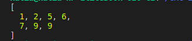

# Insertion Sort: JavaScript Implementation

This repository contains an implementation of the **insertion sort** algorithm in JavaScript.

## What the Algorithm Does

The algorithm sorts an array by:

1. Iterating through each element starting from index 1.
2. Assuming the array from 0 to i-1 is already sorted.
3. Taking the current element and inserting it in the correct spot.
4. Shifting elements that are larger to the right.
5. Inserting "current" in its correct position.

## Screenshots

This is the output of the test array:

